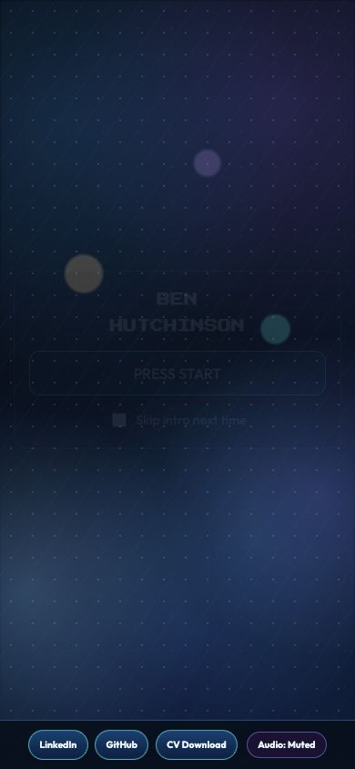

# Command-centre redesign baseline (before)

Recorded from commit `e04664340669eafed6e415281712ced2121d8379` on 2026-07-28.

## Command outputs

### `npm ci`

```text
npm warn deprecated inflight@1.0.6: This module is not supported, and leaks memory. Do not use it. Check out lru-cache if you want a good and tested way to coalesce async requests by a key value, which is much more comprehensive and powerful.
npm warn deprecated @humanwhocodes/config-array@0.13.0: Use @eslint/config-array instead
npm warn deprecated rimraf@3.0.2: Rimraf versions prior to v4 are no longer supported
npm warn deprecated glob@7.2.3: Glob versions prior to v9 are no longer supported
npm warn deprecated @humanwhocodes/object-schema@2.0.3: Use @eslint/config-array instead
npm warn deprecated eslint@8.57.1: This version is no longer supported. Please see https://eslint.org/version-support for other options.

added 160 packages in 1s

44 packages are looking for funding
  run `npm fund` for details
```

### `npm run lint`

```text
> ben-portfolio@0.1.0 lint
> eslint . --ext ts,tsx --max-warnings=0
```

### `npm run typecheck`

```text
> ben-portfolio@0.1.0 typecheck
> tsc -b
```

### `npm run build`

```text
> ben-portfolio@0.1.0 build
> tsc -b && vite build

vite v8.0.10 building client environment for production...
transforming...✓ 400 modules transformed.
rendering chunks...
computing gzip size...
dist/index.html                   0.68 kB │ gzip:  0.39 kB
dist/assets/index-BWVWk6j6.css   25.72 kB │ gzip:  6.84 kB
dist/assets/index-T9YFCnzD.js   283.65 kB │ gzip: 93.18 kB

✓ built in 933ms
```

### `du -sh dist`

```text
33M\tdist
```

### `find dist/assets -type f -maxdepth 1 -print -exec du -h {} \;`

```text
dist/assets/index-BWVWk6j6.css
28K\tdist/assets/index-BWVWk6j6.css
dist/assets/index-T9YFCnzD.js
280K\tdist/assets/index-T9YFCnzD.js
```

## Screenshots

Desktop (1440 × 900):


Mobile (390 × 844):



## Route and base-path behaviour

- Vite dev server route: `http://127.0.0.1:5173/ben-portfolio/`.
- Browser title: `Ben Hutchinson | Portfolio`.
- The initial route renders the “Press start screen”, including the `PRESS START` button.
- Selecting `PRESS START` leaves the browser at `http://127.0.0.1:5173/ben-portfolio/`.
- The CV link resolves to `/ben-portfolio/cv/ben-hutchinson-cv.pdf`.
- Production assets emitted by the build are under `dist/assets/` and are referenced with the `/ben-portfolio/` base path.
